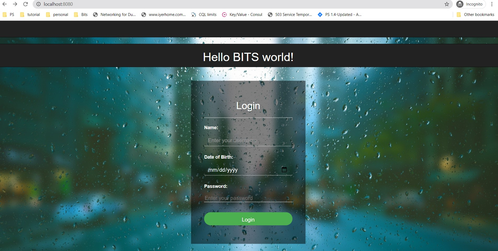

<!DOCTYPE html>
<html>
<!-- Team Container -->

<h2>OUR TEAM</h2>

Meet the team - our office rats:

 

  
  <h3>Aayushi Rathore</h3>
  
Contributor 1

  
2020mt93085

  
  <h3>Abhinav Singh Chandel</h3>
  
Contributor 2

  
2020mt93030

  
  <h3>Abhishek Gupta</h3>
  
Contributor 3

  
2020mt93262

<!-- Work Row -->

<h2>Our Work</h2>

This web application is a Open Source Project. This helps us to find our at present age. This application can be used by anyone. No paid subscription is required. Collaborators are welcomed to join our team and enhance this application further. 

  
  

  <h3>Login Page</h3>
  

  

  
   

</body>
</html>
